# Automatic_code_writing_assistant

## 安裝步驟
### 下載
- git clone https://github.com/milk333445/Automatic_code_writing_assistant.git

### 確保資料夾中有以下資料
- homepage.py
- pages

## 事前準備
```python
pip install -r requirements.txt
```

### 執行
- 打開終端機，切到homepage.py目錄下，執行以下程式
```python=
streamlit run homepage.py
```
- 會自動開啟網頁，也可複製結果網址開啟
## 輸入api key
- 確保在網頁右方輸入自己的openai_api key

## 結果範例

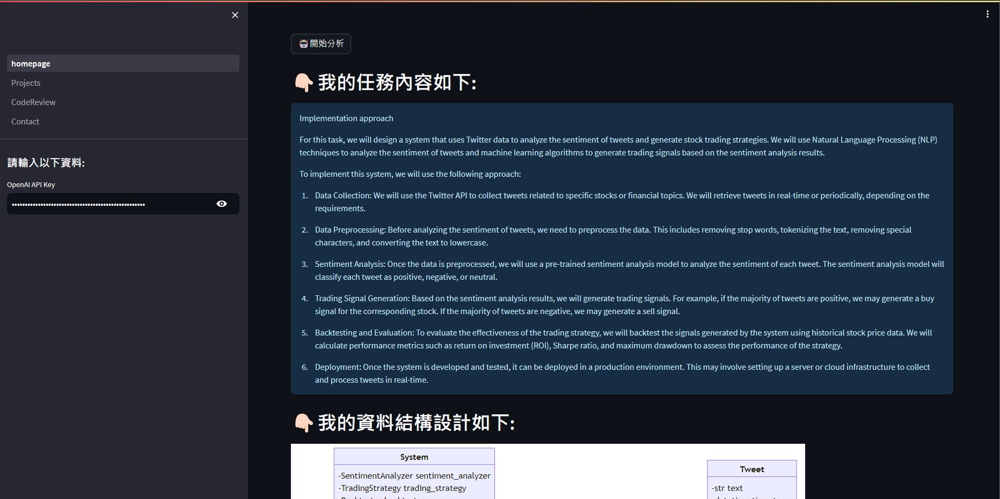
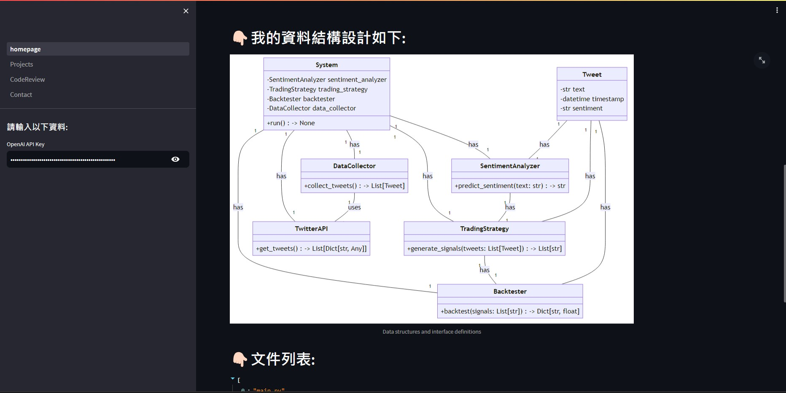
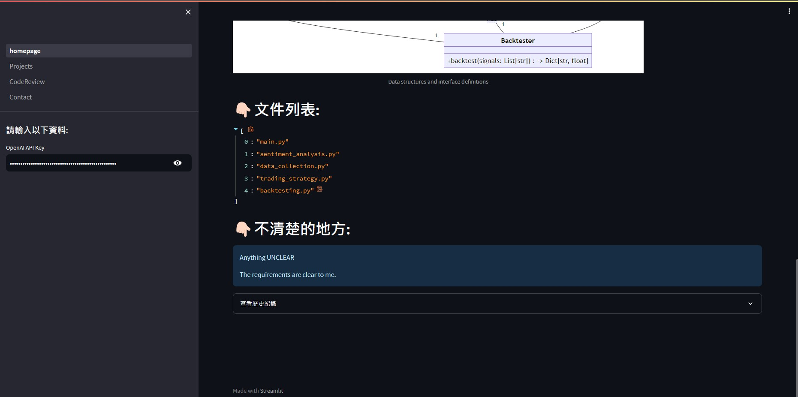
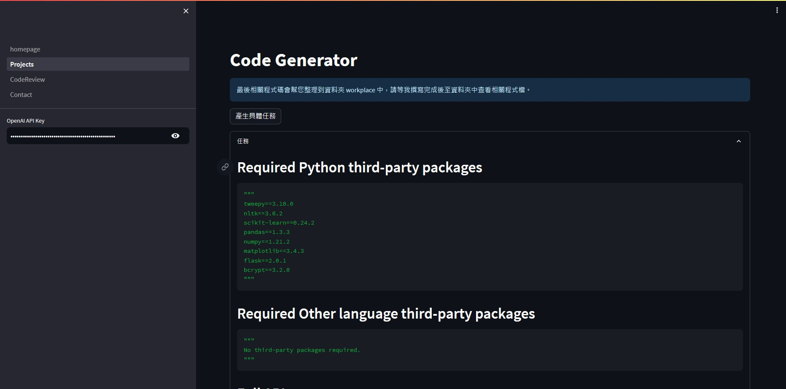
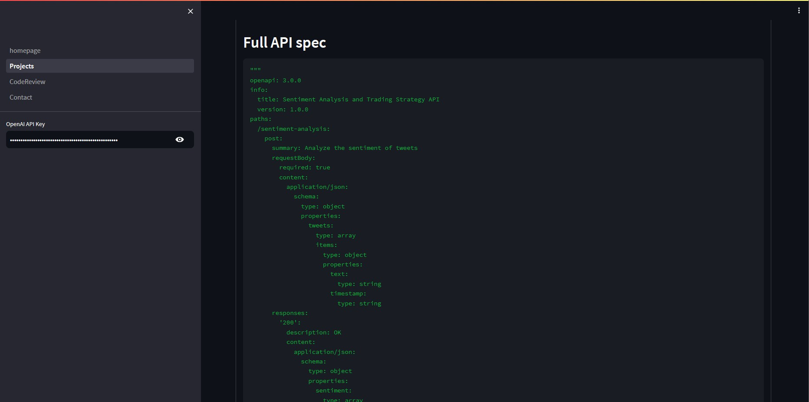
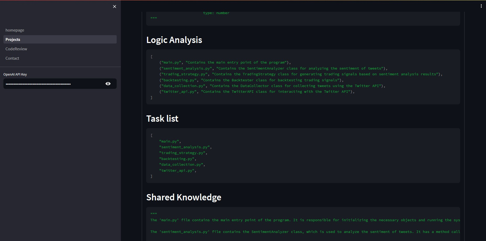
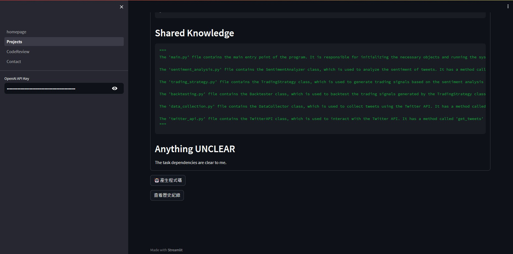
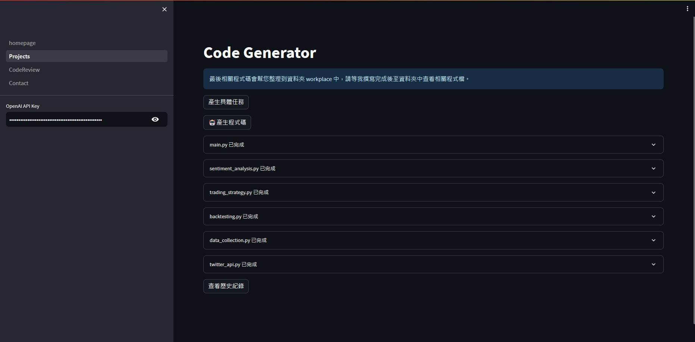
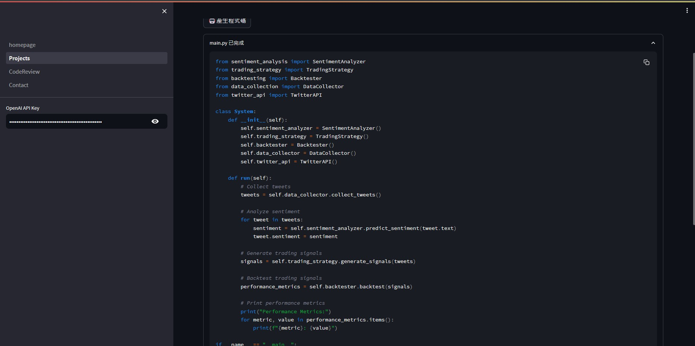
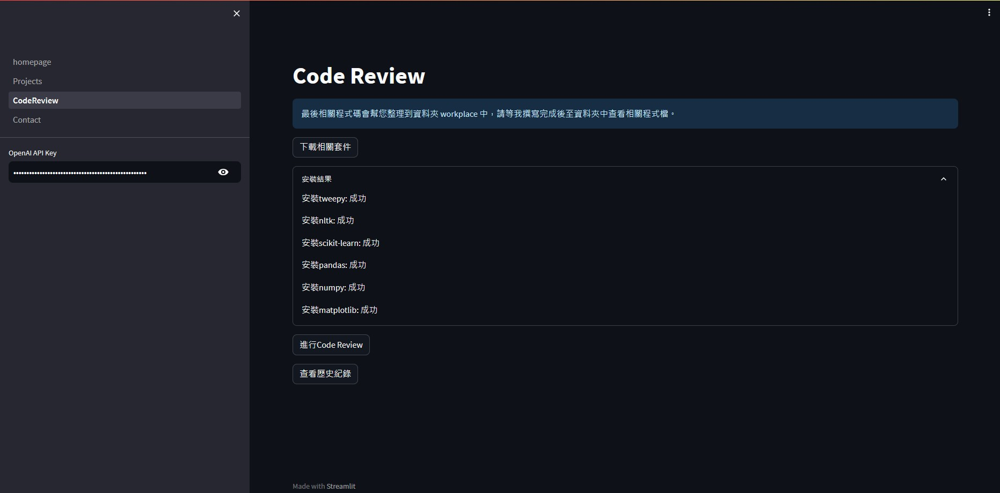
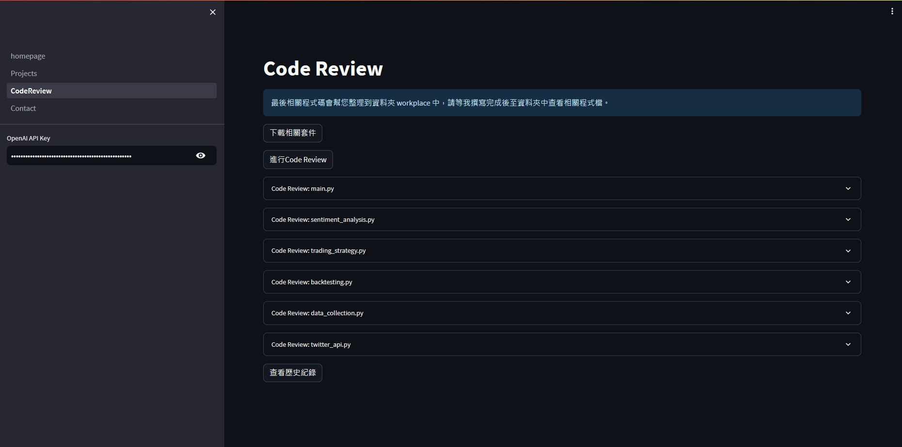
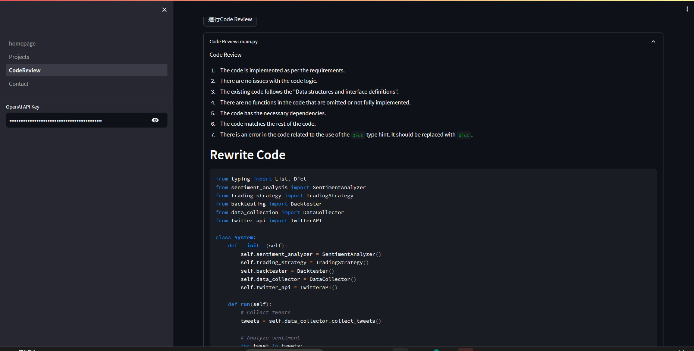
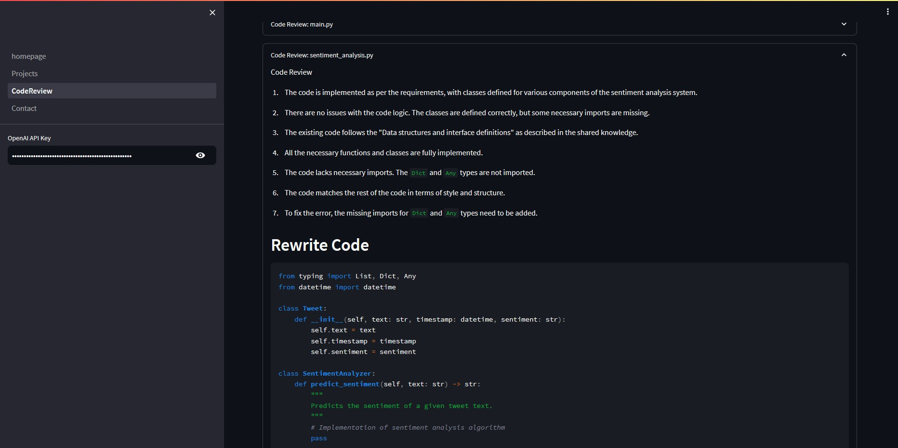
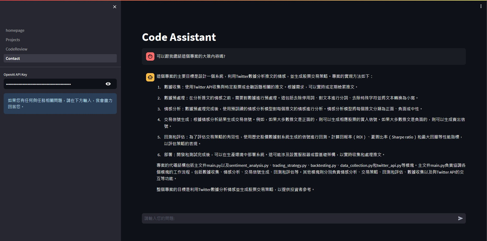
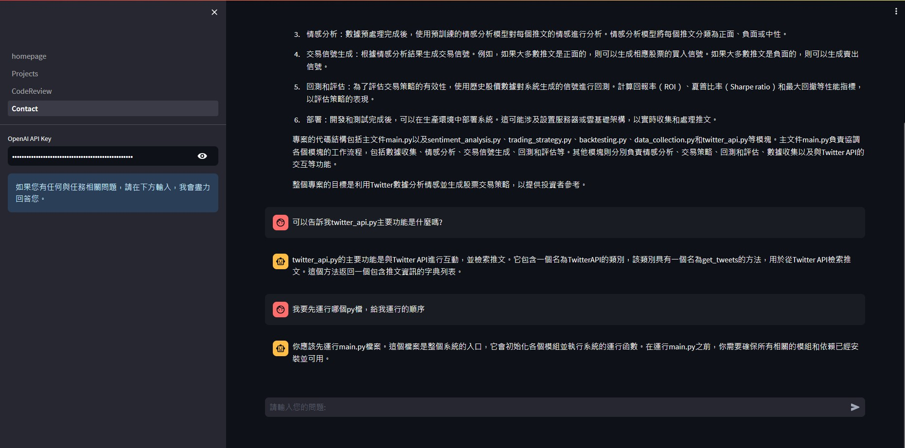

