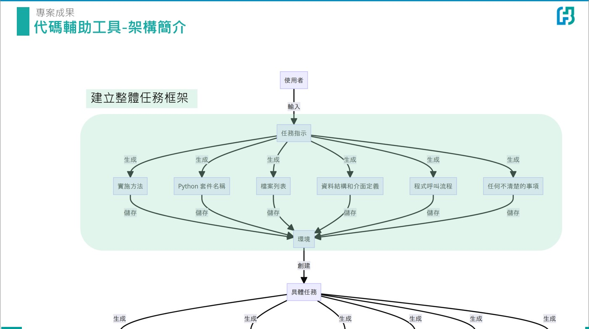
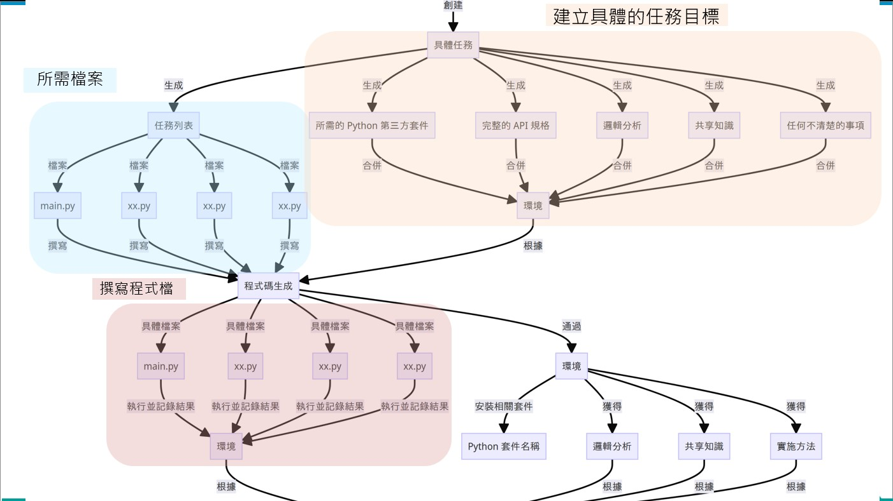
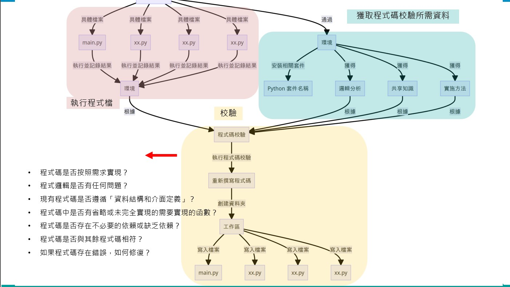
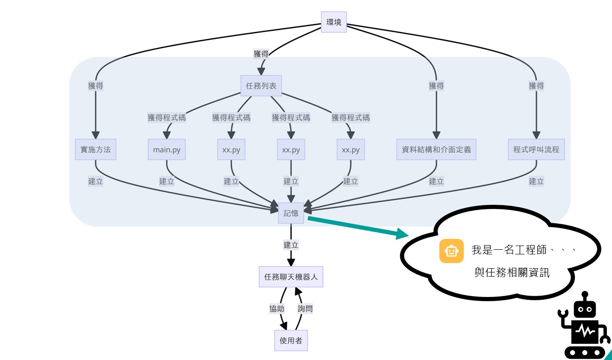

# Automatic_code_writing_assistant

## Installation Steps
### Download
- git clone https://github.com/milk333445/Automatic_code_writing_assistant.git

### Ensure the folder contains the following files
- homepage.py
- pages

## Prerequisites
```python
pip install -r requirements.txt
```

### Execution
- Open the terminal, navigate to the directory of homepage.py, and execute the following command
```python=
streamlit run homepage.py
```
- The webpage will automatically open, or you can copy the resulting URL to open it.
## Input API Key
- Make sure to input your own openai_api key on the right side of the webpage.


## structure





## Example Results
### Input Question


### Code Writing Functionality


### Code Review and Rewriting


### Interacting with Task Bot


