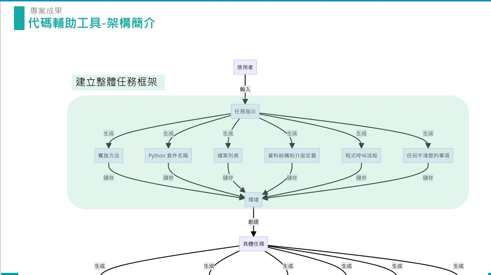
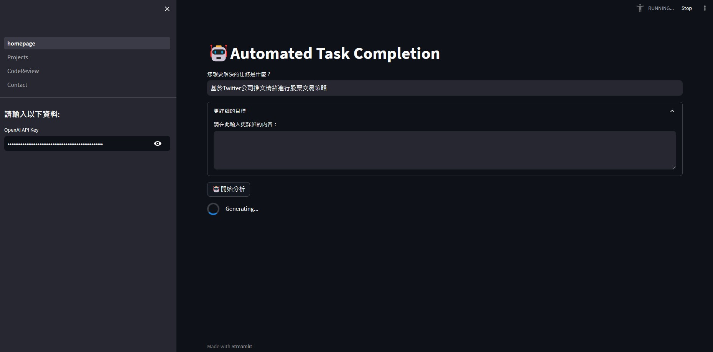

# Automatic_code_writing_assistant
## Introduction
This tool is designed to serve as a program assistant, simplifying the intricacies of software development by implementing structured development processes. 

- Program Assistant Tool: This tool is designed to serve as a program development assistant, simplifying the complexities of software development.

- Structured Development Processes: Utilizing the method of "Metacognitive Prompting," it establishes a highly structured development workflow, encompassing everything from task architecture and code writing to automated execution and validation.

- Task Information Chatbot: It introduces a task information chatbot to further enhance the development process. This chatbot is a valuable resource for developers, offering prompt answers to queries and providing assistance, ultimately leading to a significant reduction in the time spent searching for solutions.


## Installation Steps
### Download
- git clone https://github.com/milk333445/Automatic_code_writing_assistant.git

### Ensure the folder contains the following files
- homepage.py
- pages

## Prerequisites
```python
pip install -r requirements.txt
```

### Execution
- Open the terminal, navigate to the directory of homepage.py, and execute the following command
```python=
streamlit run homepage.py
```
- The webpage will automatically open, or you can copy the resulting URL to open it.
## Input API Key
- Make sure to input your own openai_api key on the right side of the webpage.


## structure


## Example Results
### Input Question



### Code Writing Functionality


### Code Review and Rewriting


### Interacting with Task Bot


